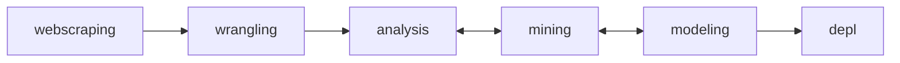

# instagram-x-tiktok
This is an end-to-end (under development) data science project to compare Instagram and TikTok market performance.  The web scraping and data usage are permitted by BusinessOfApps.

# PROJECT CYCLE UNDERSTANDING

This project has linear steps mixed with iterative ones, so the tasks can be divided into four main steps for a better linear understanding:

- Gain permission for Data Extraction - Data Transformation
- Exploratory Data Analysis and Data Mining I
- Data Mining II and Modeling (Machine Learning development)
- Deploy: Interactive DataViz with ML modeled data in a web app dashboard

# WEBSCRAPING

## DATA EXTRACTION BRIEFING: Overview and Objectives
### Source Overview
**About the Source:** The BusinessOfApps has been selected as the data source and grantting permission to scrape and use the data for this project;  
**Target-Data Location:** Two business/market report pages on the BusinessOfApps website, one page dedicated to Instagram and another to TikTok. In both of them, the data is available in two structure categories: tables, charts. 
**Approach:** Webscraping.   

### Webscraping Goals and Details
**Summary:** Scrape all the data from two categories present on two distinct pages of the same website. These pages apparently share a similar code structure.

**URLs:**  
https://www.businessofapps.com/data/instagram-statistics/  
https://www.businessofapps.com/data/tik-tok-statistics/

**For both pages, just scrapy all elements from these categories:**  
all tables **(high priority)**  
all charts **(high priority)**  

## DATA EXTRACTION PRE-PLANNING: Pages source code analysis conclusion
**Pages Analysis:** During the page analysis, it was noticed that two pages have the same code structure and the same target categories (tables and charts) available on both pages. The TikTok page includes an extra graphic absent from the Instagram page. Also, one table on TikTok has a distinct layout with 6 columns, while all others on both pages have only 2 columns. 
**Target-Data Structures:** The table targets are available in a straightforward HTML format for extraction, and they are all present in the source code upon the initial load. However, the data from the charts is within iframes that dynamically generated through JavaScript code during user interactions in real-time. This implies that extracting this data will be more challenging, requiring a more complex algorithm.

## DATA EXTRACTION FEATURES: Tasks and requirements to attempt the scraping goals 
**Features and Requirements Summary:**

- **(High Priority)**: Understand the dynamic chart's behavior in order to develop a single algorithm for both pages. It should be able to extract data efficiently in terms of automation time duration and keeping the code as clean as possible.
- **(Lowest Priority)**: The algorithm should be easily configurable for reuse in future automations targeting new pages of the same website/page type, while minimizing the need for extensive code refactoring.

**Detailed Features, Requirements, and Work Status:** 

| **Priority** | **Feature/Requirement** | **Status** |
| :---: | :--- | :--- |
|High priority |Only use the Playwright package to perform all scraping and SQLite for storage. | Pending |
|Lowest priority |Create a user-friendly parameter file for editing this type of scraping, with selectors and details that make each extraction unique. This will make scraping easier to manage, especially for reuse. | Pending |
|High priority |Carry out agile data scraping, prioritizing speed and efficiency with an approach focused on securing raw data quickly, but not disorganized, also aiming to facilitate subsequent transformation. | Pending |
|High priority |Develop asynchronous scraping to speed up execution time, acting simultaneously on both pages. | Pending |
|High priority |Code the entire scraping implementation in a single module, using clean code techniques and SOLID principles. Modularize the lower levels of extraction logic into utility modules. | Pending |